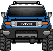
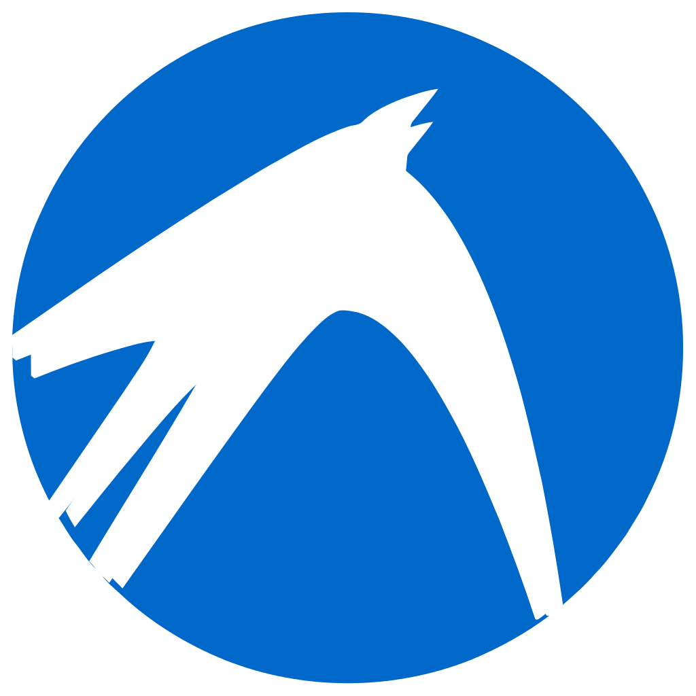

# Hi, I'm ROHAN VERMA!  ......
           
<!--- ---><!--- ---><!--- ---><!--- ---><!--- ---><!--- --->
<!--- ---><!--- ---><!--- ---><!--- ---><!--- ---><!--- ---><!--- ---><!--- ---><!--- ---><!--- ---><!--- ---><!--- ---><!--- --->

 
     

🌱 I’m currently learning HTML, CSS and JavaScript.

### Connect with me:

    
    

### Languages and Tools:

 
 

 
     

<!--
**rohan-verma19/rohan-verma19** is a ✨ _special_ ✨ repository because its `README.md` (this file) appears on your GitHub profile.

Here are some ideas to get you started:

- 🔭 I’m currently working on ...
- 🌱 I’m currently learning ...
- 👯 I’m looking to collaborate on ...
- 🤔 I’m looking for help with ...
- 💬 Ask me about ...
- 📫 How to reach me: ...
- 😄 Pronouns: ...
- ⚡ Fun fact: ...
-->
